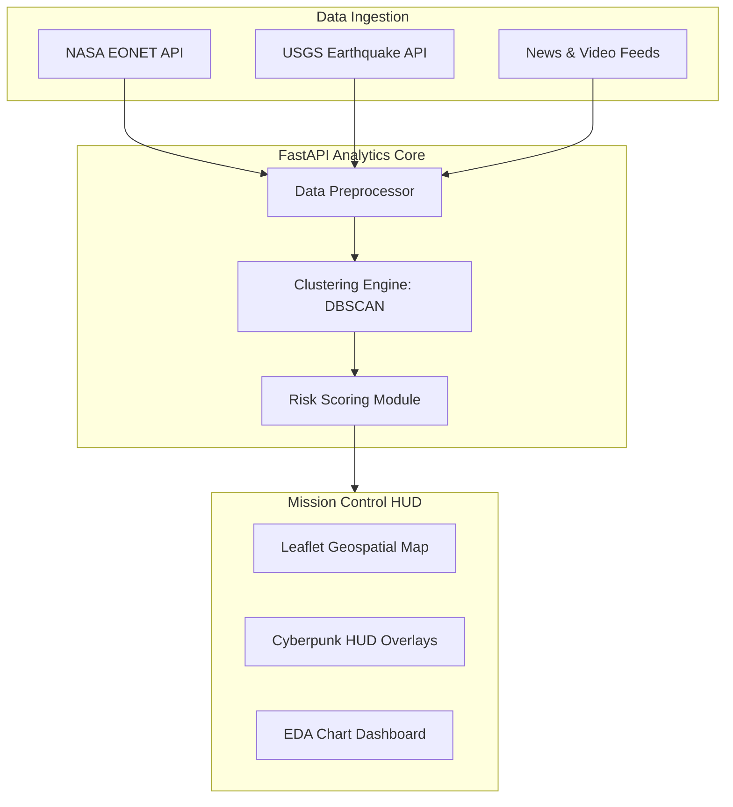
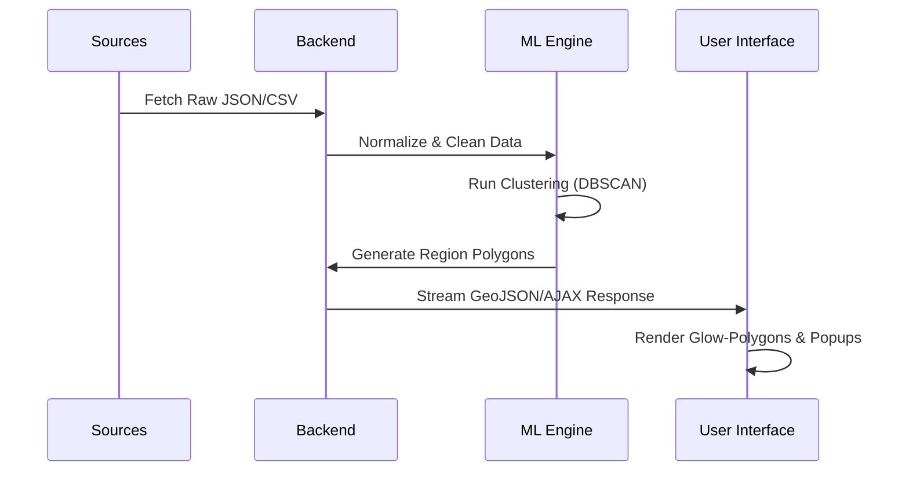

## The Propesd System
The proposed system is an AI-powered platform that monitors and analyzes natural hazards across the world. Its goal is to turn scattered disaster data into clear and useful information that people can act on.

The system collects data from multiple sources in near real time. It uses satellite data and public APIs, including NASA’s EONET for tracking events like wildfires, storms, volcanoes, and icebergs, and USGS data for monitoring earthquakes. Unlike traditional systems that depend on delayed reports, this platform keeps the data up to date by continuously processing events as they happen. It captures important details such as location (latitude and longitude), time, and intensity of each event.

All this information is combined into a single data pipeline, which is then used for geospatial analysis. This helps users clearly see where and when hazards are happening around the world, making it easier to respond quickly and make better decisions.

At the core of the system is an unsupervised machine learning approach based on HDBSCAN, which is well-suited for geospatial data with varying densities. Unlike traditional methods, the system applies clustering separately for each event type, allowing it to adapt to different spatial patterns such as dense cyclone paths and scattered wildfire occurrences.

The model uses geographic distance (haversine) to group events based on their real positions on Earth. Instead of relying on fixed distance thresholds, it automatically detects clusters using parameters like minimum cluster size and minimum samples, making it more flexible and robust for real-world hazard data. It also identifies and filters out noise, ensuring that only meaningful patterns are retained.
This approach enables the system to detect emerging hazard zones, understand how events evolve over time, and provide a clearer and more dynamic view of global hazard distribution. As a result, the platform delivers more accurate and adaptive geospatial insights for decision-making.

Beyond clustering, the platform includes a risk assessment system that evaluates how severe and active each hazard region is. For every detected cluster, the system analyzes multiple factors such as how often events occur, their average intensity, how long the activity lasts, and how it changes over time.

A base risk score is calculated by combining the number of events with their average intensity, capturing both how frequent and how strong the events are. This score is then improved using a time-aware component, which compares recent activity with past patterns to detect any increase or decrease in activity.

As a result, regions where events are rapidly increasing are identified as high-risk zones. This allows the system to go beyond static analysis and focus on areas where hazards are actively intensifying, helping provide early warning signals and better decision support.

To make the system practical and easy to use, the platform presents its insights through an interactive and visually rich interface. A 3D globe gives a global, near real-time view of hazard events, while a 2D dashboard provides detailed cluster visualizations, charts, and risk-based maps.

Users can explore how hazards are distributed, compare different event types, and quickly identify high-risk regions. The system also integrates news and video feeds to provide real-world context, helping users understand what is happening beyond the raw data.

Together, these features create a complete decision-support system that improves situational awareness and supports faster, more informed responses. While the current system focuses on detection, clustering, and risk analysis, it also provides a strong base for future improvements such as predictive modeling and advanced forecasting.

---

## Technical Specifications & Architecture

### 1. Technology Stack
The Geo Artemis platform is built on a high-performance, modular stack:

*   **Backend Engine**: FastAPI (Python 3.10+) - Asynchronous API handling.
*   **Machine Learning**: Scikit-Learn (DBSCAN/HDBSCAN), Pandas, NumPy, Scipy.
*   **Mapping Interface**: Leaflet.js - Interactive geospatial rendering.
*   **Data Visualization**: Chart.js & Plotly - Statistical EDA dashboards.
*   **UI/UX Framework**: Vanilla CSS3 (Cyberpunk HUD design system) & JavaScript (ES6).
*   **Data Strategy**: Distributed CSV-based persistence for high-speed analysis.

---

### 2. System Architecture Diagram
The following diagram outlines the data flow from ingestion to visualization:

---

### 3. Key Advanced Features

*   **Cyberpunk HUD Architecture**: An immersive, mission-critical interface with real-time signal monitors and animated overlays.
*   **AJAX-Driven Interaction**: Zero-reload map updates for clusters and regions, ensuring a seamless data exploration experience.
*   **Hazard Deep Scan**: Intelligent risk identification using pulse-animated markers and real-time hazard severity assessment.
*   **Automated ML Pipeline**: Integrated data fetching, preparation, and model training within a single unified workflow.
*   **Dynamic Region Generation**: Real-time computation of Convex Hull polygons to visualize hazard boundaries precisely.

---

### 4. Machine Learning Workflow

---

### 5. Future Prospects
*   **Predictive Modeling (LSTM)**: Leveraging temporal data to forecast the expansion and intensity of hazard clusters.

*   **Collaborative Response Units**: Multi-user synchronization for distributed disaster management teams.
*   **Mobile Field HUD**: A lightweight, responsive version of the mission control interface for field operatives.

---
*Document Version: 4.0.1 | Last Updated: 2026-04-25*
